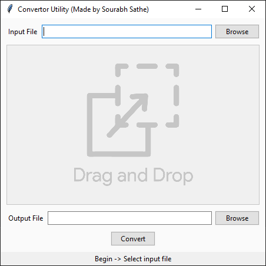

# Convertor Utility

This python app allows you to convert images, audios and videos from one format to another.

GUI made in python using `Tkinter` module.

### Features:

-   Drag-n-Drop functionality for files.
-   HiDPI display support.
-   Image conversion using `PIL` library.
-   Audio and Video conversion using `ffmpeg`.

### Supported file formats:

-   `Image` - JPEG, PNG, TIFF, ICO, WEBP
-   `Audio` - MP3, WAV, FLAC, OGG
-   `Video` - MP4, AVI, FLV, MOV, MKV, WEBM

### Prerequisites:

-   [`ffmpeg`](https://ffmpeg.org/download.html) (Make sure the PATH variable for ffmpeg is set correctly)

### Python Dependencies:

-   [`hdpitkinter` library](https://pypi.org/project/hdpitkinter/) (For HiDPI display support)
-   [`Pillow` module](https://pypi.org/project/Pillow/) (Friendly PIL fork by Alex Clark and Contributors)
-   [`OpenCV`](https://pypi.org/project/opencv-python/)

Install the above python dependencies using the following command

    pip install -r requirements.txt

### Known issues:

-   Drag-n-Drop functionality not working when script is run through cmd **(as admin)** on Windows.
